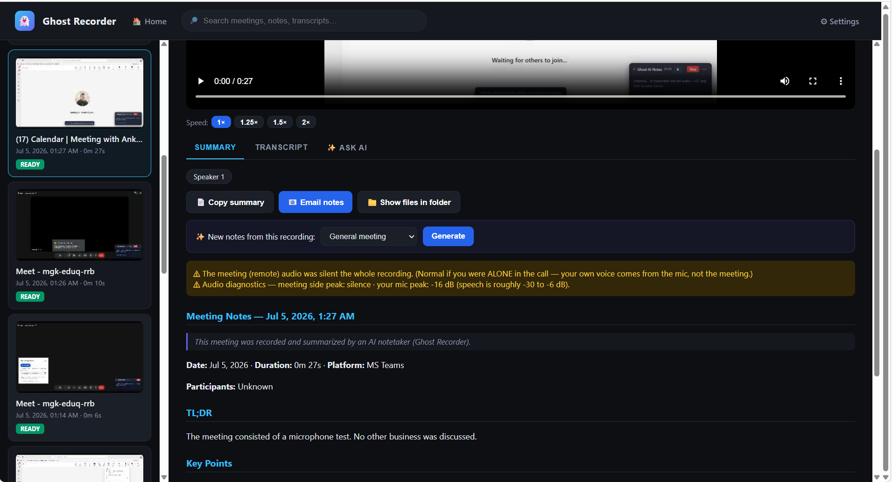
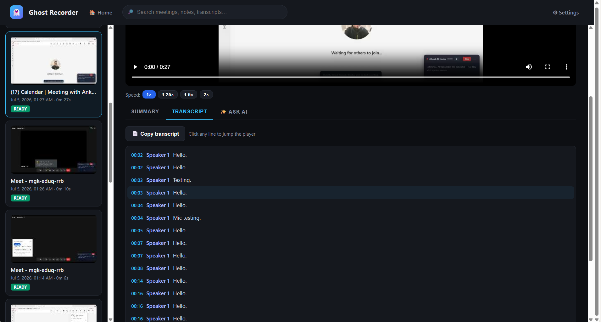
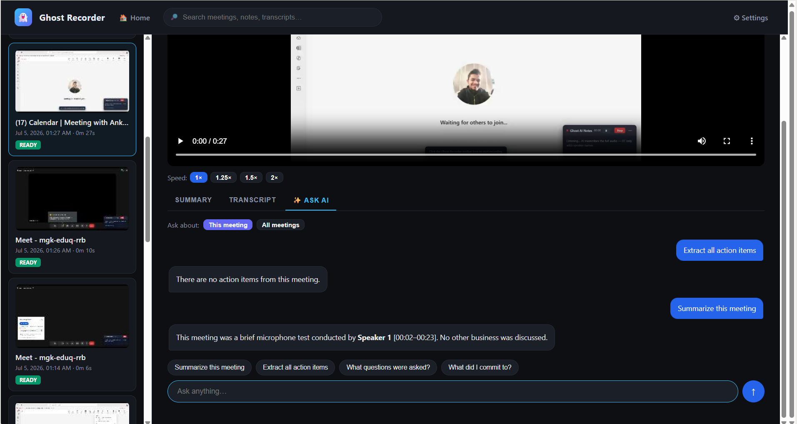
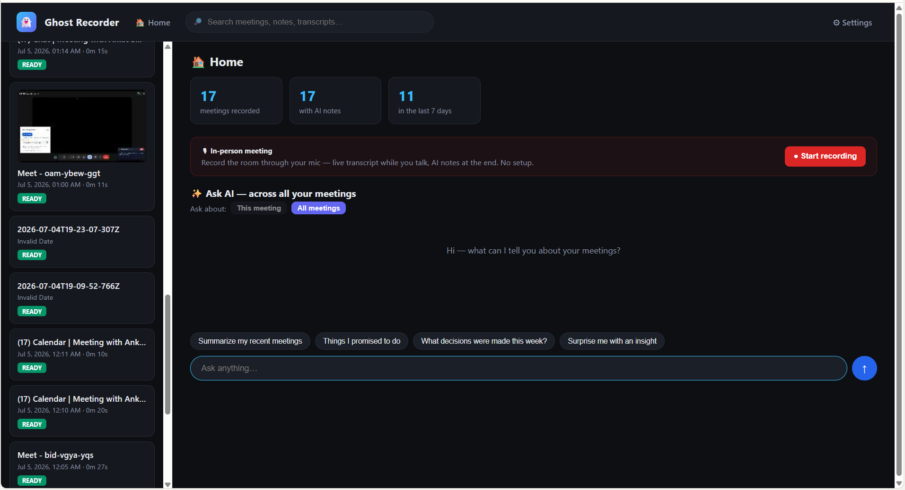
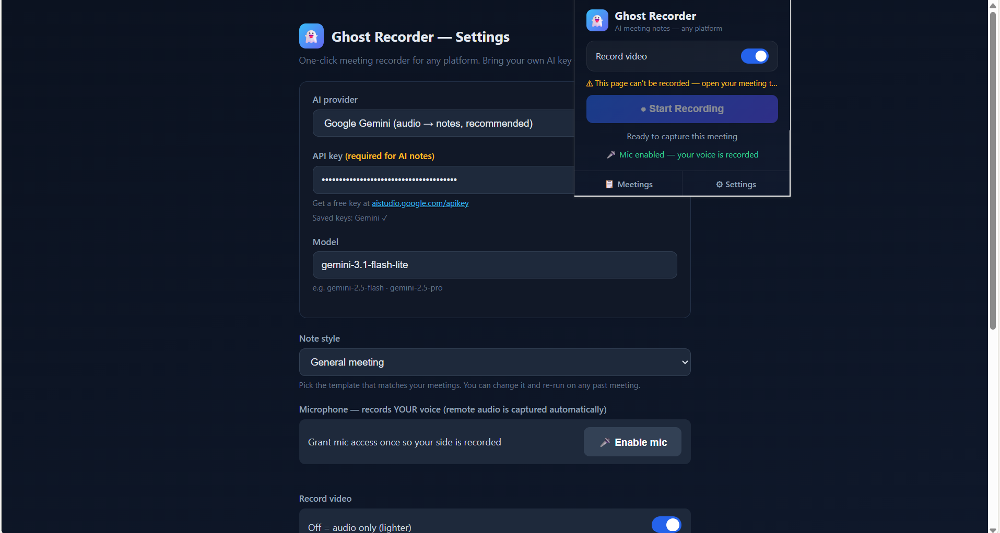
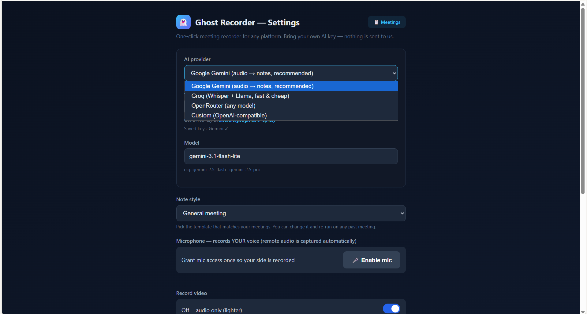

# 👻 Ghost Recorder

**One-click AI meeting notetaker for any platform — no bot joins your call, no server, no subscription.**

A Chrome (MV3) extension that records the meeting **tab** (video + both-sides audio), then uses **your own AI key** (Gemini / Groq / OpenRouter / any OpenAI-compatible endpoint) to produce Fathom-style notes: summary, decisions, action items, and a **timestamped speaker transcript you can click to jump the recording**. Everything stays on your machine except the audio sent to the AI provider *you* configured.

  



## Why Ghost Recorder?

| | Ghost Recorder | Bot notetakers (Fathom, Fireflies) | Local apps (Meetily) |
|---|---|---|---|
| Joins your meeting as a participant | **No — invisible tab capture** | Yes (a bot appears) | No |
| Works on | **Any web meeting platform** | Zoom/Meet/Teams only | Any (whole-system audio) |
| Records video | **Yes, meeting tab only** | Yes | No |
| Your audio data goes to | **Your own AI provider key** | Their cloud | Local |
| Install weight | ~100 KB unpacked | Account + calendar access | GBs of models |
| Price | **Free, BYOK** | Freemium | Free |

## Features
- 🎥 **Tab-scoped recording** — captures only the meeting tab, even when you switch tabs or minimize; no system lag.
- 🔊 **Both sides, no echo** — remote audio + your mic mixed with echo cancellation; live warnings if either side goes silent.
- 📝 **AI notes with templates** — General / Sales (BANT + CRM snippet) / 1:1-Standup; regenerate any meeting with a different template.
- 🖱️ **Click-to-seek transcript** — `[mm:ss] Speaker:` lines; click a line, the built-in player jumps there.
- ✨ **Ask AI** — chat with one meeting or your whole meeting history ("What did I promise this week?").
- 🛟 **Failsafes** — crash-recovery snapshots every 20s, recordings kept locally for replay/retry, silent-failure notifications.
- 🌐 **Universal meeting detection** — auto-suggests recording on Meet, Zoom, Teams, Webex, Jitsi, Discord, and any WebRTC site.
- 📁 **Local files** — per-meeting folder in Downloads (`Ghost Recordings/2026-07-04 14-30 Google Meet/`) with video, audio, notes.md.
- 🔐 **BYOK** — keys live in `chrome.storage.local`, sent only to the provider you chose. No account, no telemetry, no middleman server.

## See it in action

| | |
|---|---|
| **🖱 Click-to-seek transcript** — click any line, the player jumps there |  |
| **✨ Ask AI** — chat with one meeting or your whole history |  |
| **🏠 Home** — stats, in-person recorder, Ask across all meetings |  |
| **⏺ One-click popup** — shows exactly which tab it will record |  |
| **🔑 BYOK settings** — Gemini, Groq, OpenRouter or any OpenAI-compatible endpoint |  |

## Install (unpacked, 2 minutes)
1. Download/clone this repo.
2. Open `chrome://extensions`, enable **Developer mode**, click **Load unpacked**, select the `extension/` folder.
3. The Settings page opens — pick a provider, paste a free API key ([Gemini](https://aistudio.google.com/apikey) or [Groq](https://console.groq.com/keys)), press **Test**, click **🎤 Enable mic**.
4. Join any meeting → click the ghost icon → **Start Recording** (or accept the auto-suggest prompt).

## Repo map
```
extension/   The Chrome extension — load this folder unpacked
docs/        Screenshots used in this README
```

## Architecture (60 seconds)
Service worker (`background.js`) orchestrates; an **offscreen document** (`offscreen.js`) does the heavy lifting: `chrome.tabCapture` → Web Audio graph (tab→record+monitor, mic→record only) → dual `MediaRecorder` (audio webm-opus, video vp8) → EBML duration patch (seekable files) → IndexedDB (playback/retry/crash-recovery) → `chrome.downloads`. `providers.js` turns audio into notes (Gemini native audio; Groq Whisper→Llama; OpenRouter `input_audio`). MAIN-world scripts pin call audio to the default output sink (this is what makes **Microsoft Teams** recordable) and detect live WebRTC. The dashboard (`dashboard.html`) is the app: player, tabs, Ask AI.

## Privacy
See [PRIVACY.md](PRIVACY.md). Short version: nothing is collected by us — there is no "us" server. Recordings stay on your device; audio/transcripts go only to the AI provider whose key you pasted, when notes are generated. A consent line is appended to notes by default; **you are responsible for complying with recording-consent laws in your jurisdiction** — tell people you're recording.

## Contributing
PRs welcome — see [CONTRIBUTING.md](CONTRIBUTING.md). Good first issues: Zoom/Teams caption-DOM selectors, VAD silence-trimming before upload, map-reduce summarization for 2h+ meetings.

## Author
Built by **[Ankit Sundriyal](mailto:ankitsundriyal0@gmail.com)** — an AI-native product manager who ships. This is one of a series of open-source products designed, spec'd, and driven end-to-end with AI-assisted engineering.

## License
[MIT](LICENSE)
